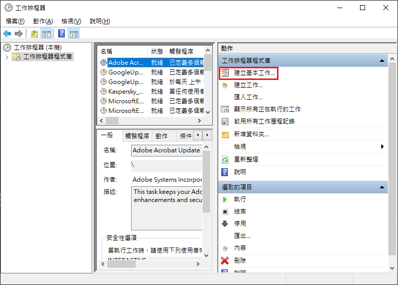
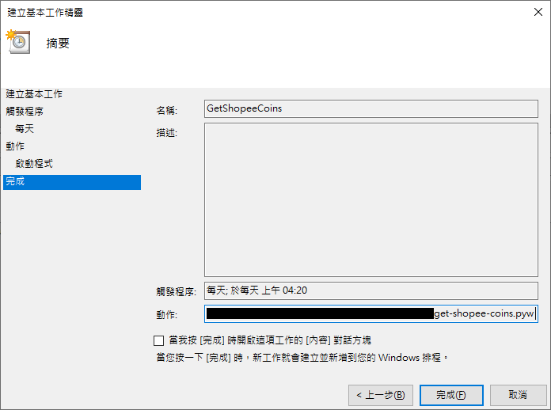

# Get Shopee Coins
Get your shoppe coins easily and automatedly!

# Usage
### Setup
1. Install selenium (check [Package Requirements](#package-requirements))
2. Put [ChromeDriver](https://chromedriver.chromium.org/downloads) under the home path (e.g., C:\Users\User)
3. Run `get-shopee-coins-setup.py` and complete login process
4. Close `get-shopee-coins-setup.py` when you see '_Setup completed successfully_'
### Get coins! (With 2 options)
1. Run `get-shopee-coins.pyw` to get coins
2. Use Windows Task Scheduler to run `get-shopee-coins.pyw` periodically
    
    

_Note: ChromeDriver's version should be the same as Chrome's version_

# Test Environment
+ Windows 10
+ Python 3.9.0

# [Package Requirements](./requirements.bat)
+ selenium==4.0.0

# License
This project is under the [MIT License](./LICENSE).
